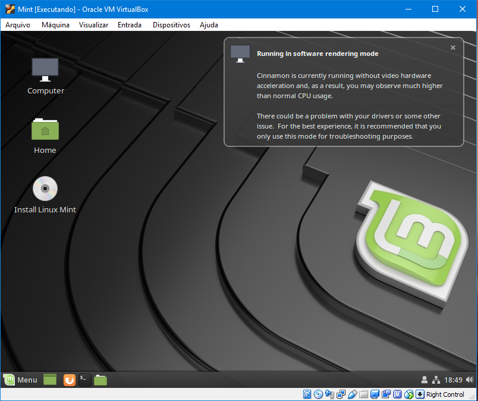
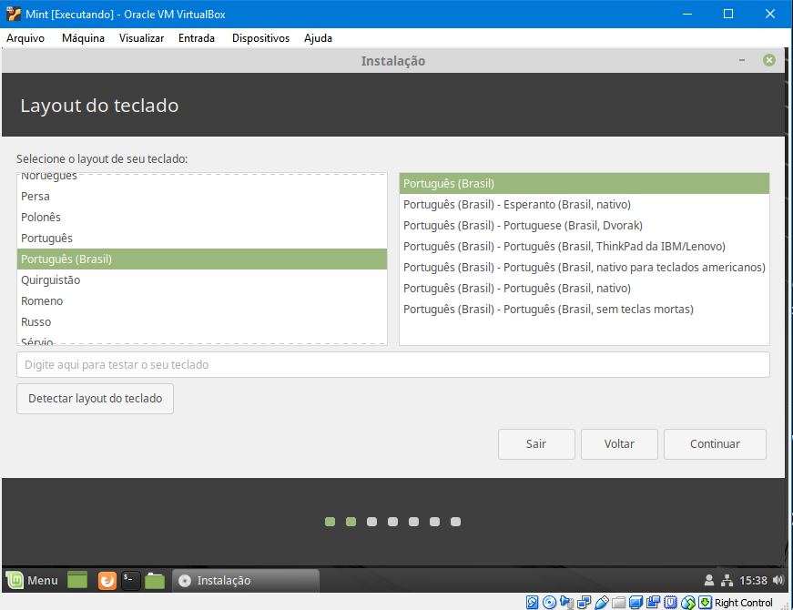
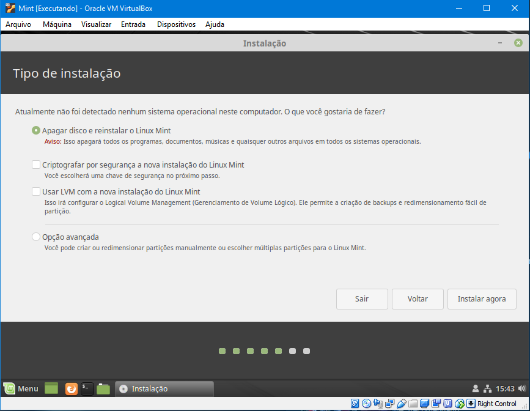
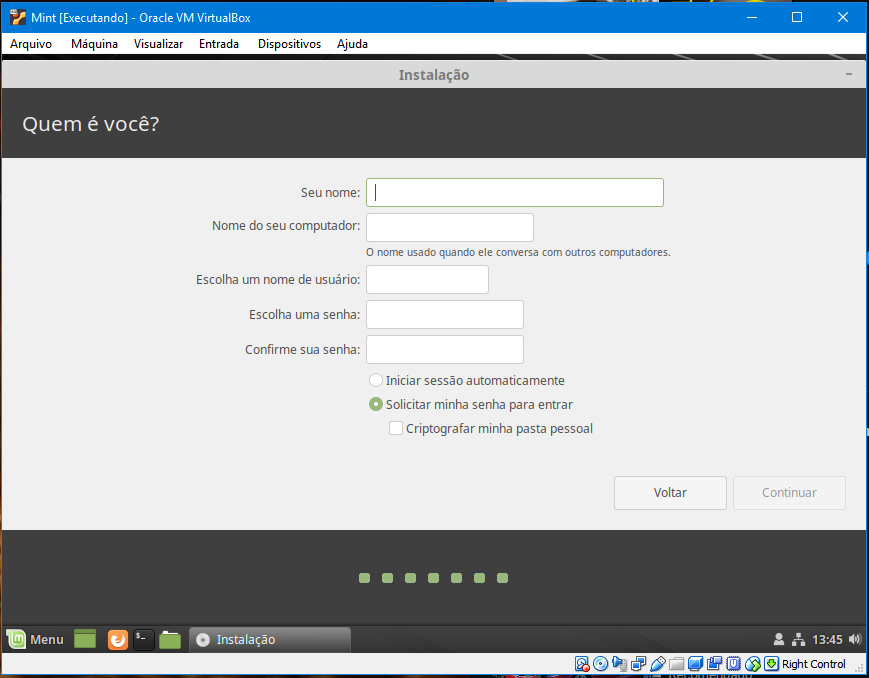
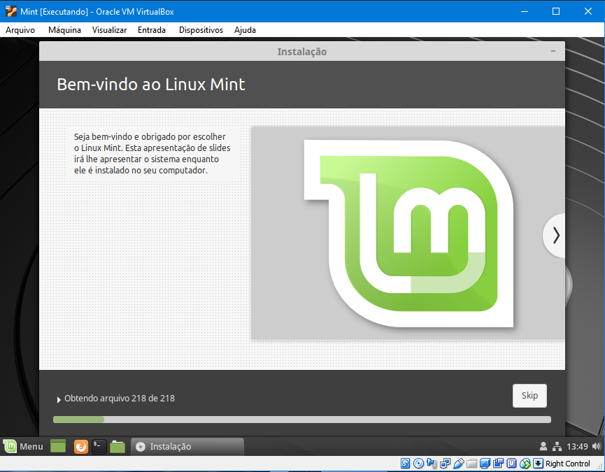
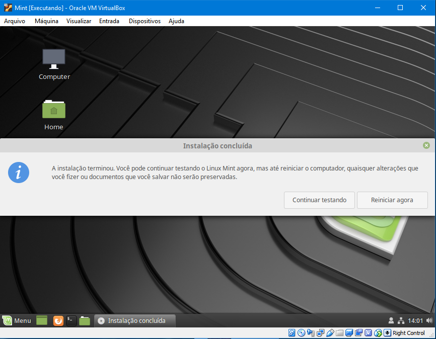
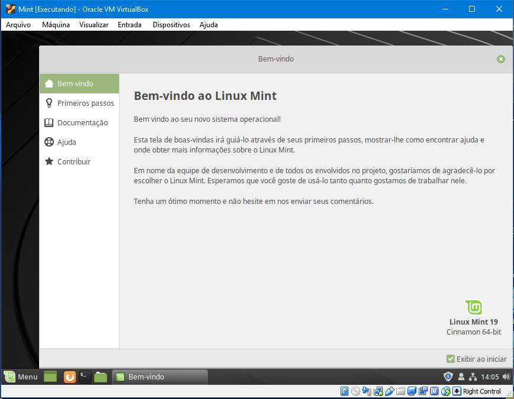

# Vamos aprender a instalar o Mint-Linux

    
 
  Hoje vamos mostrar um passo a passo de como instalar o Mint_Linux. Mas antes de darmos inicio, vamos saber o que é o Mint_Linux:
  
  O objetivo do Linux Mint é produzir um sistema operacional moderno, elegante e confortável, que seja poderoso e fácil de usar.

O Linux Mint é uma das distribuições Linux de desktop mais populares e usado por milhões de pessoas.

Algumas das razões para o sucesso do Linux Mint são:

Funciona fora da caixa, com suporte multimídia completo e é extremamente fácil de usar.
É livre de custos e de código aberto.
É dirigido pela comunidade. Os usuários são encorajados a enviar feedback ao projeto para que suas ideias possam ser usadas para melhorar o Linux Mint.
Baseado no Debian e no Ubuntu, ele fornece cerca de 30.000 pacotes e um dos melhores gerenciadores de software.
É seguro e confiável. Graças a uma abordagem conservadora para atualizações de software, um exclusivo Gerenciador de Atualizações e a robustez de sua arquitetura Linux, o Linux Mint requer pouca manutenção (sem regressões, sem antivírus, sem anti-spyware ... etc.).

**OBS :** O processo de instalação do sistema operacional será feito a partir do Virtual Box, e o sistema ultilizado é o Cinnamon.

**Link para Dowload do Mint_Linux :**<a href = "https://linuxmint.com/download.php">Clique aqui<a/>

## Passo a passo para instalação:

### 1.   Ao execultar a ISO(DVD) ou arquivo de BOOT clique em **Install Linux Mint** para prosseguir com a instalação:
   
   
   
### 2.   Selecione a Lingua desejada e o Layout e clique em continuar até chegar a próxima etapa do Tutorial:
   
   
   
### 3.   Selecionne o tipo de instalaçãoe clique em continuar até chegar a próxima etapa do Tutorial:
   

**OBS:** Nesse caso no tutorial foi utilizada a opção de formattar o disco e instalar o Linux sem Partições, porém indo pela opção avançada tem mais opções de particionamento e etc.


### 4.   Usuário e senha:
   

**OBS:** A senha é opicional.


### 5.   Aguarde a finalização da instalação e reinicie a máquina:
 


### Agora a proveite esse mundo de pocibilidades que é o Linux atravez da distribuição Mint:


```markdown
Tutorial feito por: Hugo de Almeida Póvoa do Vale

Senac Duque de Caxias-RJ

```
